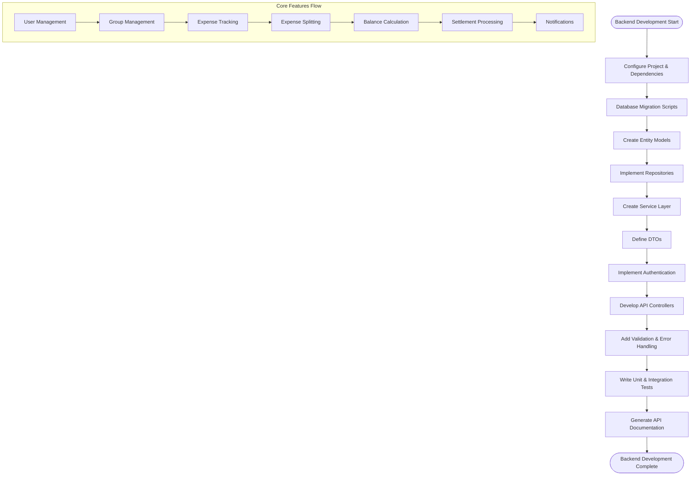

```mermaid
flowchart TB
    Start(["Backend Development Start"]) --> Config["Configure Project & Dependencies"]
    Config --> DB["Database Migration Scripts"]
    DB --> Models["Create Entity Models"]
    Models --> Repos["Implement Repositories"]
    Repos --> Services["Create Service Layer"]
    Services --> DTOs["Define DTOs"]
    DTOs --> Auth["Implement Authentication"]
    Auth --> APIs["Develop API Controllers"]
    APIs --> Valid["Add Validation & Error Handling"]
    Valid --> Test["Write Unit & Integration Tests"]
    Test --> Doc["Generate API Documentation"]
    Doc --> End(["Backend Development Complete"])
    
    subgraph "Core Features Flow"
        F1["User Management"] --> F2["Group Management"]
        F2 --> F3["Expense Tracking"]
        F3 --> F4["Expense Splitting"]
        F4 --> F5["Balance Calculation"]
        F5 --> F6["Settlement Processing"]
        F6 --> F7["Notifications"]
    end
```