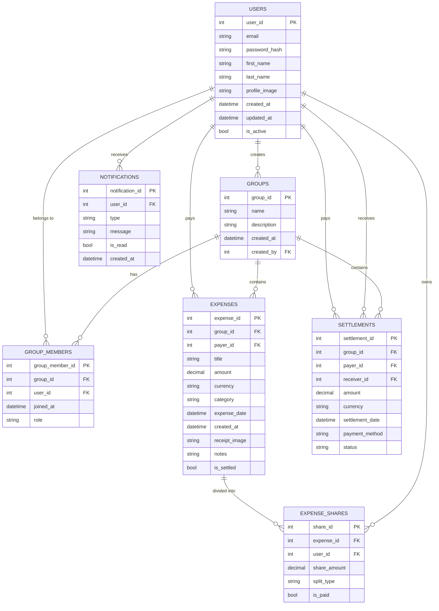

```mermaid
erDiagram
    USERS {
        int user_id PK
        string email
        string password_hash
        string first_name
        string last_name
        string profile_image
        datetime created_at
        datetime updated_at
        bool is_active
    }
    
    GROUPS {
        int group_id PK
        string name
        string description
        datetime created_at
        int created_by FK
    }
    
    GROUP_MEMBERS {
        int group_member_id PK
        int group_id FK
        int user_id FK
        datetime joined_at
        string role
    }
    
    EXPENSES {
        int expense_id PK
        int group_id FK
        int payer_id FK
        string title
        decimal amount
        string currency
        string category
        datetime expense_date
        datetime created_at
        string receipt_image
        string notes
        bool is_settled
    }
    
    EXPENSE_SHARES {
        int share_id PK
        int expense_id FK
        int user_id FK
        decimal share_amount
        string split_type
        bool is_paid
    }
    
    SETTLEMENTS {
        int settlement_id PK
        int group_id FK
        int payer_id FK
        int receiver_id FK
        decimal amount
        string currency
        datetime settlement_date
        string payment_method
        string status
    }
    
    NOTIFICATIONS {
        int notification_id PK
        int user_id FK
        string type
        string message
        bool is_read
        datetime created_at
    }
    
    USERS ||--o{ GROUPS : "creates"
    USERS ||--o{ GROUP_MEMBERS : "belongs to"
    GROUPS ||--o{ GROUP_MEMBERS : "has"
    USERS ||--o{ EXPENSES : "pays"
    GROUPS ||--o{ EXPENSES : "contains"
    EXPENSES ||--o{ EXPENSE_SHARES : "divided into"
    USERS ||--o{ EXPENSE_SHARES : "owns"
    USERS ||--o{ SETTLEMENTS : "pays"
    USERS ||--o{ SETTLEMENTS : "receives"
    GROUPS ||--o{ SETTLEMENTS : "contains"
    USERS ||--o{ NOTIFICATIONS : "receives"

```