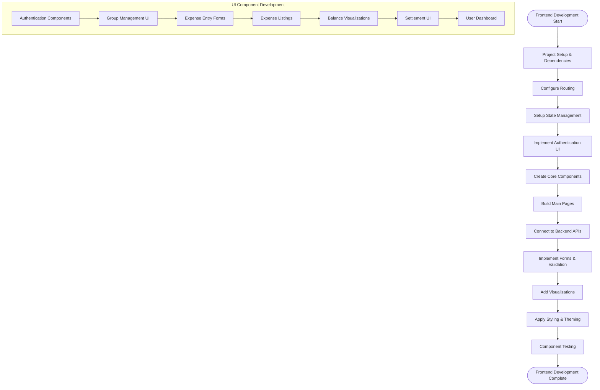

```mermaid
flowchart TB
    Start(["Frontend Development Start"]) --> Setup["Project Setup & Dependencies"]
    Setup --> Routes["Configure Routing"]
    Routes --> State["Setup State Management"]
    State --> Auth["Implement Authentication UI"]
    Auth --> Comp["Create Core Components"]
    Comp --> Pages["Build Main Pages"]
    Pages --> API["Connect to Backend APIs"]
    API --> Forms["Implement Forms & Validation"]
    Forms --> Viz["Add Visualizations"]
    Viz --> Theme["Apply Styling & Theming"]
    Theme --> Test["Component Testing"]
    Test --> End(["Frontend Development Complete"])
    
    subgraph "UI Component Development"
        C1["Authentication Components"] --> C2["Group Management UI"]
        C2 --> C3["Expense Entry Forms"]
        C3 --> C4["Expense Listings"]
        C4 --> C5["Balance Visualizations"]
        C5 --> C6["Settlement UI"]
        C6 --> C7["User Dashboard"]
    end
```